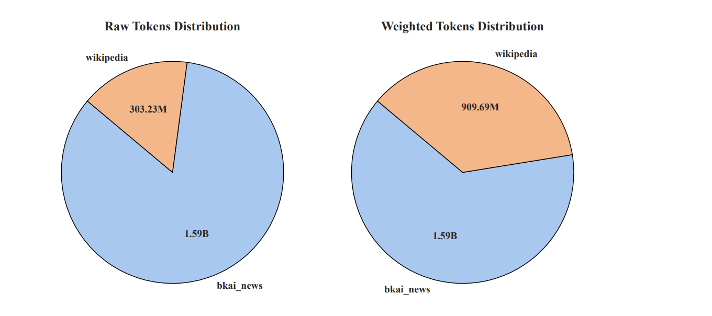
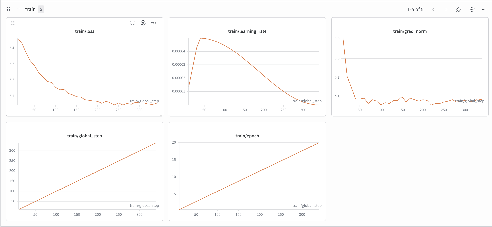
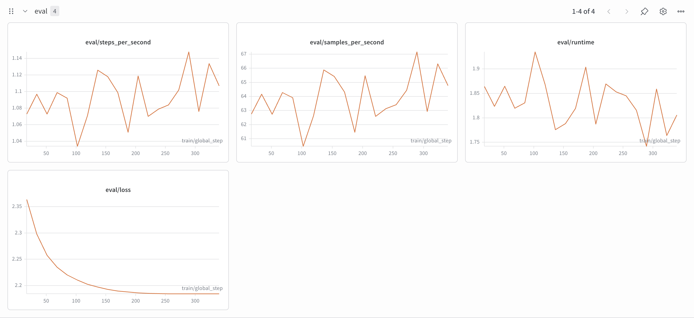

# Vietnamese GPT-2: Stage 1 Base Pretraining + Stage 2 Health Continued Pretraining

This repository implements a two-stage Vietnamese GPT-2 training pipeline:

1. Stage 1 trains a Vietnamese GPT-2 model from random initialization on a mixed general-domain corpus.
2. Stage 2 continues pretraining that base model on a health-domain corpus collected from Vietnamese disease articles.

The project includes data collection, cleaning, tokenizer training, corpus deduplication, distributed Stage 1 training, and single-GPU Stage 2 domain adaptation.

Website:


## Project Scope

The codebase currently supports:

- Downloading and preparing `BKAINewsCorpus`
- Crawling and cleaning Vietnamese Wikipedia articles
- Training a byte-level BPE tokenizer for Vietnamese
- Deduplicating the pretraining corpus with document- and paragraph-level filtering
- Pretraining GPT-2 from scratch for general Vietnamese language modeling
- Crawling, cleaning, and structuring a health-domain dataset from Tam Anh Hospital
- Continued pretraining on the health corpus
- Logging training and evaluation metrics with Weights & Biases

## Repository Structure

```text
gpt2-disease/
├── data_prep/
│   ├── deduplicate.py
│   ├── news/
│   │   └── download_datasets.py
│   ├── wiki/
│   │   ├── crawl_vi_wiki.py
│   │   └── process_vi_wiki.py
│   └── health/
│       ├── crawl_disease_index.py
│       ├── scape_disease.py
│       └── process_disease_content.py
├── image:video/
│   ├── distribution.png
│   ├── train_health.png
│   └── eval_health.png
├── scripts/
│   ├── train_1.sh
│   └── train_2.sh
├── src/
│   ├── config.py
│   ├── train_tokenizer.py
│   ├── train_1.py
│   ├── train_2.py
│   └── utils.py
├── artifacts/
├── requirements.txt
└── stage1.md
```

## Environment

Recommended environment:

- Python `3.11+`
- NVIDIA GPU with CUDA support
- `uv` for dependency management
- `flash-attn` for faster Stage 1 attention, if your CUDA environment supports it

Install dependencies:

```bash
uv sync
uv pip install -e .
```

If you prefer `pip`, you can also use:

```bash
pip install -r requirements.txt
```

## Training Overview

### Stage 1: General Vietnamese Pretraining

Stage 1 builds the base model from scratch. The model is initialized from a GPT-2 configuration, but the weights are random. The objective is to learn Vietnamese syntax, style, and broad world knowledge before any domain-specific adaptation.

The Stage 1 pipeline consists of four major parts:

1. Collect and clean general-domain corpora
2. Train a Vietnamese tokenizer
3. Deduplicate the corpus
4. Pretrain GPT-2 on the weighted data mixture

#### Stage 1 data sources

The base model is trained from two complementary sources:

- `BKAINewsCorpus`: large-scale Vietnamese news text with structured sentence form and relatively formal journalistic style
- Vietnamese Wikipedia: encyclopedic, multi-domain text with broader factual coverage and more natural explanatory prose

These sources play different roles:

- BKAI provides scale and consistent written structure.
- Wikipedia provides higher knowledge density across many domains and a more natural, coherent expository style.

#### Why Wikipedia is weighted 3x relative to BKAI

This choice is explicitly reflected in [`src/config.py`](./src/config.py), where the Stage 1 data mixture is:

```python
DATASETS = [
    {"path": "data/train/deduped/bkai_train.parquet", "weight": 1},
    {"path": "data/train/deduped/vi_wiki_articles_clean.parquet", "weight": 3},
]
```

The reason is not that Wikipedia is larger than BKAI. It is the opposite: the raw token count of Wikipedia is much smaller, so the project intentionally upsamples it during training.

The rationale, consistent with the Stage 1 write-up, is:

- Wikipedia has more natural and coherent explanatory language than news, which is often concise and strongly tied to current events.
- Wikipedia carries dense encyclopedic knowledge across many fields, which is useful for building the model's general knowledge base.
- Repeating Wikipedia in the mixture increases its influence on gradients without physically duplicating the deduplicated Parquet file on disk.
- The weighted mixture also helps the training corpus reach the Stage 1 token budget target more closely.

The chart below summarizes the raw and weighted token distributions:



From the figure:

- Raw tokens:
  - `bkai_news`: about `1.59B`
  - `wikipedia`: about `303.23M`
- Weighted tokens used during training:
  - `bkai_news`: about `1.59B`
  - `wikipedia`: about `909.69M`

In other words, Wikipedia is sampled three times in the effective training mixture so that it has a much stronger contribution during optimization. This brings the effective total close to the configured Stage 1 budget of `2.48B` tokens.

#### Stage 1 data preparation

Download BKAI news:

```bash
uv run python data_prep/news/download_datasets.py
```

Crawl and clean Vietnamese Wikipedia:

```bash
uv run python data_prep/wiki/crawl_vi_wiki.py
uv run python data_prep/wiki/process_vi_wiki.py
```

Train the tokenizer:

```bash
uv run python src/train_tokenizer.py
```

Deduplicate the corpus:

```bash
uv run python data_prep/deduplicate.py
```

The deduplication pipeline in `data_prep/deduplicate.py` applies:

- global exact document deduplication
- paragraph-level exact deduplication for the main corpora
- final exact document deduplication after paragraph cleanup

#### Stage 1 tokenizer

The tokenizer is trained in [`src/train_tokenizer.py`](./src/train_tokenizer.py) using `ByteLevelBPETokenizer` with:

- vocabulary size: `50257`
- minimum frequency: `2`
- special token: `<|endoftext|>`

This tokenizer is trained directly on the Vietnamese corpora used by the project rather than reusing the original English-oriented GPT-2 tokenizer.

#### Stage 1 training details

Stage 1 is implemented in [`src/train_1.py`](./src/train_1.py). Important design choices:

- model architecture: GPT-2 configuration loaded from `gpt2`, but initialized with random weights
- max sequence length: `1024`
- token budget: `2_480_000_000`
- eval split: `1%`
- optimizer schedule: cosine decay with warmup
- precision: `bf16` when CUDA is available
- memory optimization: gradient checkpointing
- attention backend: `flash_attention_2`
- checkpointing: save every `500` steps, keep the best model by `eval_loss`

The training script:

```bash
bash scripts/train_1.sh
```

By default, `scripts/train_1.sh` launches distributed training on 2 GPUs:

- `CUDA_VISIBLE_DEVICES=0,1`
- `torchrun --nproc_per_node=2 src/train_1.py`

The Stage 1 pipeline also:

- appends an EOS token after each document
- packs tokens into fixed 1024-token blocks
- computes `max_steps` automatically from the token budget
- resumes from the last checkpoint when available
- exports `log_history.csv` for later analysis

### Stage 2: Health-Domain Continued Pretraining

Stage 2 adapts the general Vietnamese base model to a narrower health domain. Instead of restarting from scratch, the code loads the final Stage 1 model and continues causal language model pretraining on cleaned disease articles.

This is implemented in [`src/train_2.py`](./src/train_2.py).

#### Stage 2 health data pipeline

The health corpus is built in three steps.

Step 1: crawl the A-Z disease index page from Tam Anh Hospital and collect article links:

```bash
uv run python data_prep/health/crawl_disease_index.py --save-html
```

Step 2: visit each disease page and save the extracted article content:

```bash
uv run python data_prep/health/scape_disease.py --save-html
```

Step 3: clean the scraped articles into train-ready JSONL and Parquet files:

```bash
uv run python data_prep/health/process_disease_content.py
```

Key output files used in Stage 2:

- raw disease link metadata: `data/raws/health_disease_links.csv`
- raw scraped articles: `data/raws/health_disease_content.jsonl`
- cleaned training corpus: `data/train/health_disease_clean.jsonl`

#### Stage 2 training details

Stage 2 loads the Stage 1 final model from:

- `./artifacts/checkpoints/rand-init/final`

Important training settings from [`src/config.py`](./src/config.py):

- epochs: `20`
- batch size: `32`
- learning rate: `5e-5`
- weight decay: `0.1`
- max length: `512`
- eval split: `10%`
- precision: `bf16` when CUDA is available
- scheduler: cosine with warmup

The preprocessing logic differs from Stage 1 in a few important ways:

- each health sample is normalized and terminated with EOS
- inputs are truncated or padded to length `512`
- labels are masked on padding positions with `-100`
- training and evaluation splits are created after tokenization

Run Stage 2 with:

```bash
bash scripts/train_2.sh
```

By default, `scripts/train_2.sh` uses a single GPU:

- `CUDA_VISIBLE_DEVICES=0`

It saves checkpoints and evaluates once per epoch, then keeps the best model according to `eval_loss`.

#### Stage 2 training results

The repository already includes the Stage 2 training and evaluation plots:



Based on the training curves:

- training loss decreases steadily from about `2.46` to about `2.05`
- the learning rate follows the intended warmup-then-cosine-decay schedule
- gradient norm drops quickly at the start and then stays stable around roughly `0.56-0.60`
- the run completes about `339` global steps across `20` epochs



Based on the evaluation plot:

- eval loss decreases from about `2.36` to about `2.18`
- the curve improves smoothly and then flattens, which suggests stable continued pretraining rather than unstable overfitting early in training
- evaluation throughput stays consistent across epochs, indicating the run is operationally stable

Overall, the included Stage 2 plots show that the health-domain continued pretraining converged cleanly and improved the model on the held-out health split.

## End-to-End Workflow

If you want to run the full pipeline from scratch, the order is:

```bash
# Stage 1 data
uv run python data_prep/news/download_datasets.py
uv run python data_prep/wiki/crawl_vi_wiki.py
uv run python data_prep/wiki/process_vi_wiki.py

# Tokenizer + dedup
uv run python src/train_tokenizer.py
uv run python data_prep/deduplicate.py

# Stage 1 training
bash scripts/train_1.sh

# Stage 2 health data
uv run python data_prep/health/crawl_disease_index.py --save-html
uv run python data_prep/health/scape_disease.py --save-html
uv run python data_prep/health/process_disease_content.py

# Stage 2 training
bash scripts/train_2.sh
```

## Outputs

Typical outputs are written under `artifacts/`:

- `artifacts/tokenizer/`: trained tokenizer files
- `artifacts/checkpoints/rand-init/`: Stage 1 checkpoints and final base model
- `artifacts/checkpoints/continued-pretrain-health/`: Stage 2 checkpoints and final health-adapted model
- `artifacts/logs/`: shell-script training logs

## Notes

- Stage 1 uses a weighted data mixture. The deduplicated datasets on disk remain unique; only the in-memory training mixture is repeated by weight.
- Stage 1 depends on `flash_attention_2` in the current code path, so a compatible CUDA environment is recommended.
- Stage 2 depends on the current HTML structure of the Tam Anh website. If the site layout changes, the scraping selectors may need to be updated.
- The training-result summaries in this README are based on the provided plots inside `image:video/`.

## Summary

This repository is a practical Vietnamese GPT-2 training pipeline with a clear two-stage design:

- Stage 1 builds a general Vietnamese base model from BKAI news and weighted Vietnamese Wikipedia
- Stage 2 adapts that model to the health domain through continued pretraining on cleaned disease articles

The README now reflects the actual codebase, the Stage 1 dataset-mixing rationale, and the included Stage 2 result visualizations.
